# Blueprint Apparel

A full-featured e-commerce platform with a custom admin dashboard, built with Django.

**Live Site**: [blueprnt.store](https://blueprnt.store)

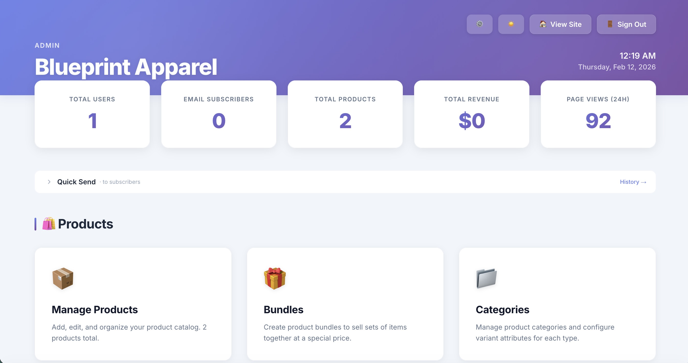

## Highlights

This isn't just a store — it's a complete business management system with:

- **Custom Admin Dashboard** — Built from scratch (no Django admin templates), featuring real-time stats, customizable widgets, and a modern UI
- **Inventory & Shipment Tracking** — Track incoming shipments, manage stock levels, FIFO cost tracking
- **Marketing Suite** — Email/SMS campaigns, A/B testing, subscriber management, scheduling
- **Financial Analytics** — Revenue tracking, COGS calculations, profit margins by product, inventory valuation
- **Hero Slideshow Manager** — Drag-to-reorder, split-view support, image uploads

## Admin Dashboard

The admin system is the core of this project — a complete back-office solution for running an e-commerce business.

### Products & Inventory
- Product management with variants (size, color, material)
- Stock tracking with low-stock alerts
- Bulk variant editing
- Cost tracking at product, variant, and shipment levels

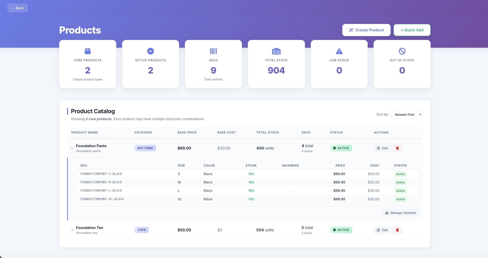

### Shipments
- Track incoming inventory shipments
- Auto-calculate costs (items + shipping + customs + fees)
- Mark items as received to update stock

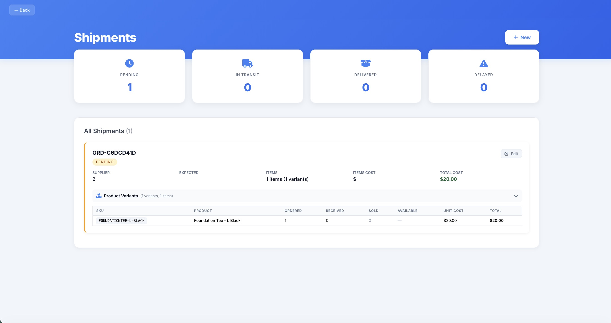

### Marketing
- **Campaigns** — Multi-message email/SMS campaigns with scheduling
- **A/B Testing** — Track variant performance with UTM parameters
- **Quick Send** — Send messages directly from dashboard
- **Subscriber Management** — CSV import, activity tracking

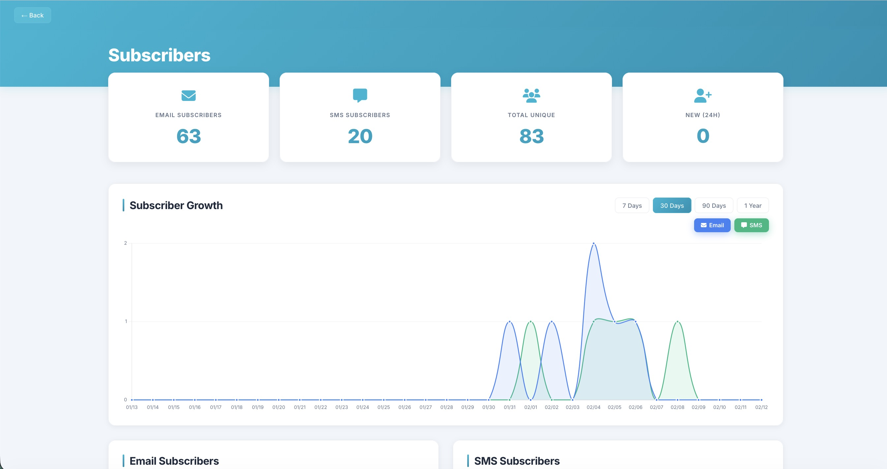

### Finance
- Revenue tracking with date filters
- Cost of Goods Sold (COGS) from FIFO-allocated orders
- Gross profit, operating expenses, net profit
- Inventory valuation with potential profit projections
- Per-product profit breakdown with margin indicators

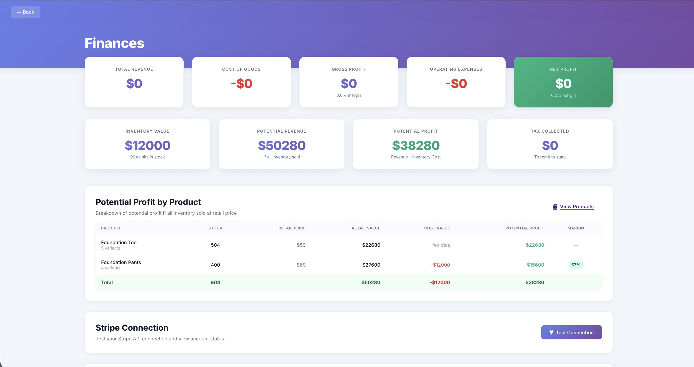

### Orders & Fulfillment
- Order management with status tracking
- Shipping label generation (EasyPost)
- Manual order creation
- Returns & exchanges processing

### Site Customization
- Hero slideshow management with drag-to-reorder
- Split-view slides (70/30 layout)
- Quick links to external services (Stripe, GitHub, etc.)

## Tech Stack

| Category | Technology |
|----------|------------|
| Backend | Django 4.2, Python |
| Frontend | Tailwind CSS, Vanilla JS |
| Database | PostgreSQL |
| Payments | Stripe Checkout |
| Email | Resend |
| SMS | Twilio |
| Shipping | EasyPost |
| Hosting | Render |
| Auth | django-allauth + custom 2FA |

## Features (Customer-Facing)

- Responsive product catalog with filtering
- Product variants with live price/stock updates
- Persistent shopping cart
- Stripe Checkout integration
- Real-time shipping rates
- Order confirmation emails
- Account management with order history

## Project Structure

```
├── shop/                   # Main app
│   ├── models/            # Product, Order, Shipment, etc.
│   ├── admin_views.py     # All admin dashboard views (~4500 lines)
│   └── utils/             # Email, SMS, shipping helpers
├── templates/
│   ├── admin/             # Custom admin templates
│   └── shop/              # Storefront templates
└── home/                  # Landing page
```

## Quick Start

```bash
# Clone and install
git clone https://github.com/yourusername/blueprint-apparel.git
cd blueprint-apparel
pip install -r requirements.txt

# Set up environment variables (see below)
cp .env.example .env

# Run migrations
python manage.py migrate

# Start development server
python manage.py runserver
```

## Environment Variables

```bash
SECRET_KEY=your-secret-key
DEBUG=True

# Stripe
STRIPE_SECRET_KEY=sk_test_xxx
STRIPE_PUBLISHABLE_KEY=pk_test_xxx
STRIPE_WEBHOOK_SECRET=whsec_xxx

# Resend (email)
RESEND_API_KEY=re_xxx

# Twilio (SMS)
TWILIO_ACCOUNT_SID=ACxxx
TWILIO_AUTH_TOKEN=xxx
TWILIO_PHONE_NUMBER=+1234567890

# EasyPost (shipping)
EASYPOST_API_KEY=xxx
```

## What I Learned

- Building a complete admin system from scratch vs. using off-the-shelf solutions
- FIFO inventory costing and financial calculations
- Integrating multiple third-party APIs (Stripe, Twilio, Resend, EasyPost)
- Managing complex data relationships (products → variants → shipment items → order items)
- Building drag-and-drop interfaces with SortableJS
- Django's ORM for complex aggregations and reporting

## Screenshots

<details>
<summary>View all screenshots</summary>

### Admin Dashboard

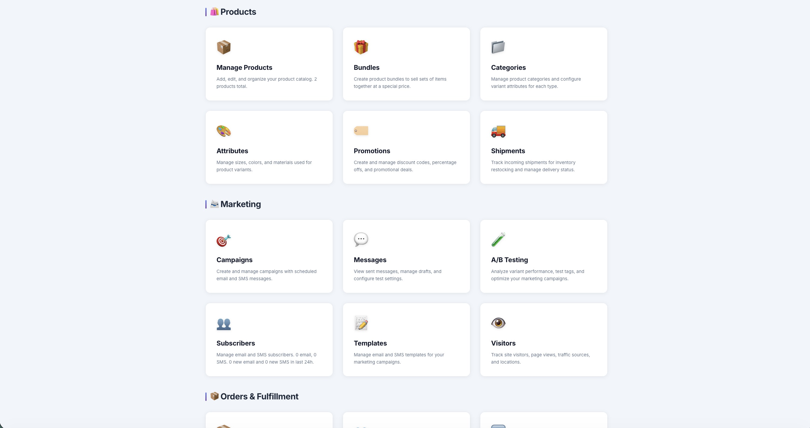

### Products & Variants

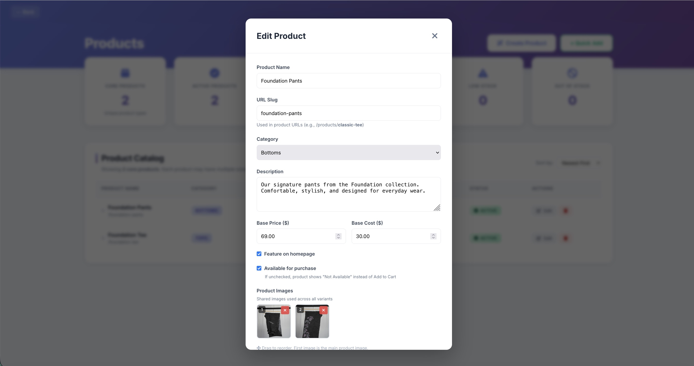
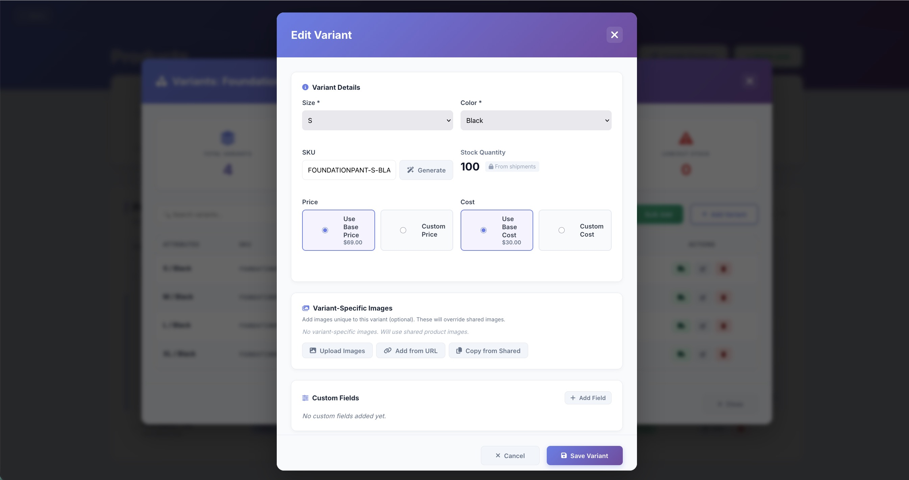

### Bundles & Shipments
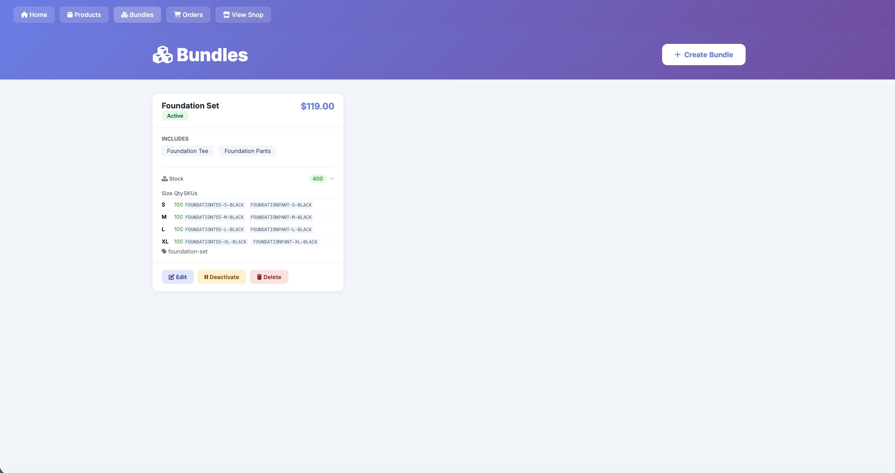


### Marketing & Messaging


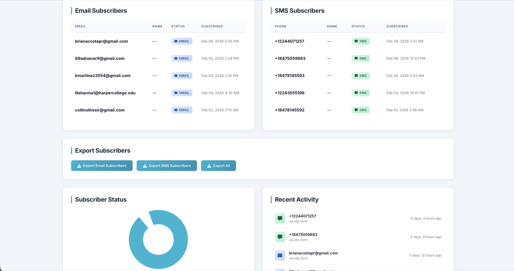

### Analytics
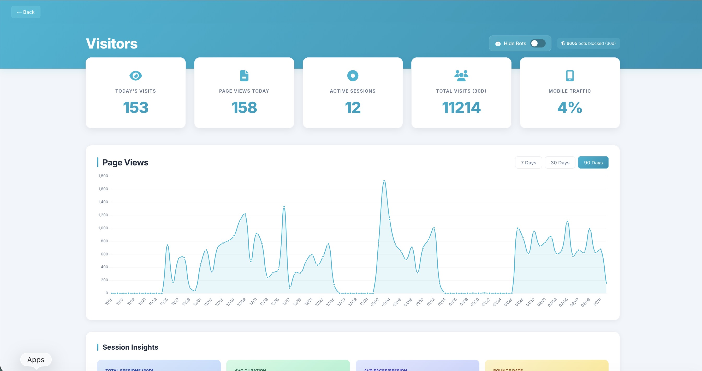


### Finance

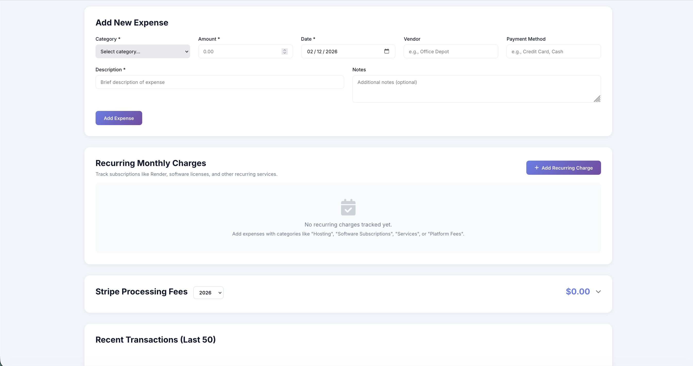

### Site Customization
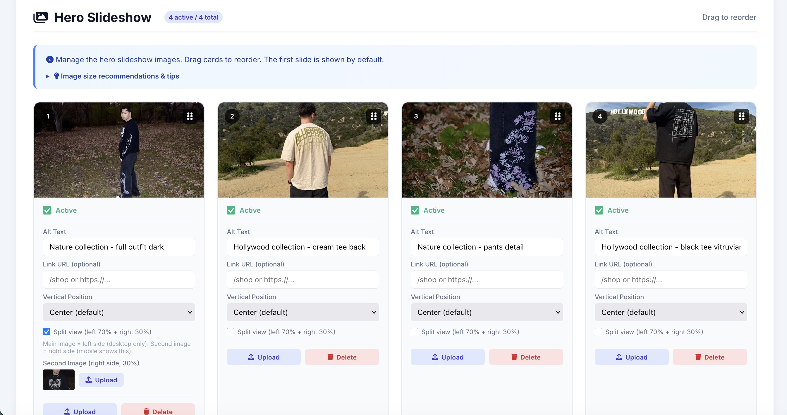

</details>

## Links

- **Live Site**: [blueprnt.store](https://blueprnt.store)
- **Instagram**: [@_blueprintapparel](https://instagram.com/_blueprintapparel)

---

Built in Chicago.
